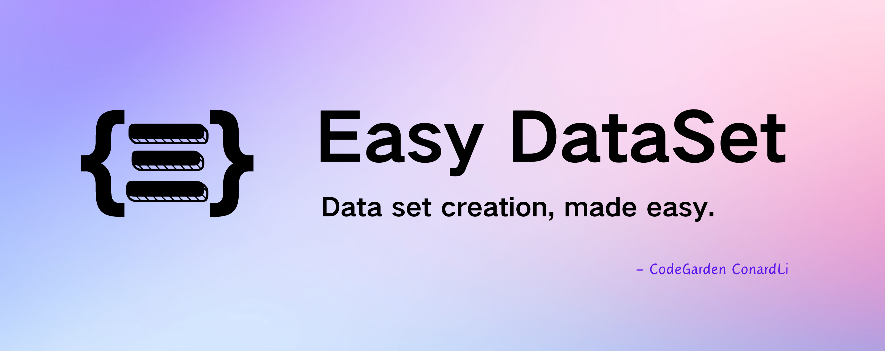

<div align="center">




**一个强大的大型语言模型微调数据集创建工具**

[简体中文](./README.zh-CN.md) | [English](./README.md)

[功能特点](#功能特点) • [快速开始](#快速开始) • [使用方法](#使用方法) • [文档](#文档) • [贡献](#贡献) • [许可证](#许可证)

</div>


如果喜欢本项目，请给本项目留下 Star⭐️，或者请作者喝杯咖啡呀 => [打赏作者](./public/imgs/aw.jpg) ❤️！

## 概述

Easy Dataset 是一个专为创建大型语言模型（LLM）微调数据集而设计的应用程序。它提供了直观的界面，用于上传特定领域的文件，智能分割内容，生成问题，并为模型微调生成高质量的训练数据。

通过 Easy Dataset，您可以将领域知识转化为结构化数据集，兼容所有遵循 OpenAI 格式的 LLM API，使微调过程变得简单高效。


## 功能特点

* **智能文档处理**：上传 Markdown 文件并自动将其分割为有意义的片段
* **智能问题生成**：从每个文本片段中提取相关问题
* **答案生成**：使用 LLM API 为每个问题生成全面的答案
* **灵活编辑**：在流程的任何阶段编辑问题、答案和数据集
* **多种导出格式**：以各种格式（Alpaca、ShareGPT）和文件类型（JSON、JSONL）导出数据集
* **广泛的模型支持**：兼容所有遵循 OpenAI 格式的 LLM API
* **用户友好界面**：为技术和非技术用户设计的直观 UI
* **自定义系统提示**：添加自定义系统提示以引导模型响应

## 本地运行

### 下载客户端

<table style="width: 100%">
  <tr>
    <td width="25%" align="center">
      <b>Windows</b>
    </td>
    <td width="25%" align="center" colspan="2">
      <b>MacOS</b>
    </td>
    <td width="25%" align="center">
      <b>Linux</b>
    </td>
  </tr>
  <tr style="text-align: center">
    <td align="center" valign="middle">
      <a href='https://github.com/ConardLi/easy-dataset/releases/latest'>
        
        <br />
        <b>Setup.exe</b>
      </a>
    </td>
    <td align="center" valign="middle">
      <a href='https://github.com/ConardLi/easy-dataset/releases/latest'>
        
        <br />
        <b>Intel</b>
      </a>
    </td>
    <td align="center" valign="middle">
      <a href='https://github.com/ConardLi/easy-dataset/releases/latest'>
        
        <br />
        <b>M</b>
      </a>
    </td>
    <td align="center" valign="middle">
      <a href='https://github.com/ConardLi/easy-dataset/releases/latest'>
        
        <br />
        <b>AppImage</b>
      </a>
    </td>
  </tr>
</table>


### 使用 NPM 安装

1. 克隆仓库：
   

```bash
   git clone https://github.com/ConardLi/easy-dataset.git
   cd easy-dataset
   ```

2. 安装依赖：
   

```bash
   npm install
   ```

3. 启动开发服务器：
   

```bash
   npm run build

   npm run start
   ```

4. 打开浏览器并访问 `http://localhost:1717`

### 使用本地 Dockerfile 构建  

如果你想自行构建镜像，可以使用项目根目录中的 Dockerfile：  

1. 克隆仓库：  
   ```bash
   git clone https://github.com/ConardLi/easy-dataset.git
   cd easy-dataset
   ```  
2. 构建 Docker 镜像：  
   ```bash
   docker build -t easy-dataset .
   ```  
3. 运行容器：  
   ```bash
   docker run -d -p 1717:1717 -v {YOUR_LOCAL_DB_PATH}:/app/local-db --name easy-dataset easy-dataset
   ```  
   **注意：** 请将 `{YOUR_LOCAL_DB_PATH}` 替换为你希望存储本地数据库的实际路径。  

4. 打开浏览器，访问 `http://localhost:1717`

## 使用方法

### 创建项目

<table>
    <tr>
        <td></td>
        <td></td>
    </tr>
</table>

1. 在首页点击"创建项目"按钮；
2. 输入项目名称和描述；
3. 配置您首选的 LLM API 设置

### 处理文档

<table>
    <tr>
        <td></td>
        <td></td>
    </tr>
</table>

1. 在"文本分割"部分上传您的 Markdown 文件；
2. 查看自动分割的文本片段；
3. 根据需要调整分段

### 生成问题

<table>
    <tr>
        <td></td>
        <td></td>
    </tr>
</table>

1. 导航到"问题"部分；
2. 选择要从中生成问题的文本片段；
3. 查看并编辑生成的问题；
4. 使用标签树组织问题

### 创建数据集

<table>
    <tr>
        <td></td>
        <td></td>
    </tr>
</table>

1. 转到"数据集"部分；
2. 选择要包含在数据集中的问题；
3. 使用配置的 LLM 生成答案；
4. 查看并编辑生成的答案

### 导出数据集

<table>
    <tr>
        <td></td>
        <td></td>
    </tr>
</table>

1. 在数据集部分点击"导出"按钮；
2. 选择您喜欢的格式（Alpaca 或 ShareGPT）；
3. 选择文件格式（JSON 或 JSONL）；
4. 根据需要添加自定义系统提示；5. 导出您的数据集

## 项目结构

```
easy-dataset/
├── app/                                # Next.js 应用目录
│   ├── api/                            # API 路由
│   │   ├── llm/                        # LLM API 集成
│   │   │   ├── ollama/                 # Ollama API 集成
│   │   │   └── openai/                 # OpenAI API 集成
│   │   ├── projects/                   # 项目管理 API
│   │   │   ├── [projectId]/            # 项目特定操作
│   │   │   │   ├── chunks/             # 文本块操作
│   │   │   │   ├── datasets/           # 数据集生成和管理
│   │   │   │   ├── generate-questions/ # 批量问题生成
│   │   │   │   ├── questions/          # 问题管理
│   │   │   │   └── split/              # 文本分割操作
│   │   │   └── user/                   # 用户特定项目操作
│   ├── projects/                       # 前端项目页面
│   │   └── [projectId]/                # 项目特定页面
│   │       ├── datasets/               # 数据集管理 UI
│   │       ├── questions/              # 问题管理 UI
│   │       ├── settings/               # 项目设置 UI
│   │       └── text-split/             # 文本处理 UI
│   └── page.js                         # 主页
├── components/                         # React 组件
│   ├── datasets/                       # 数据集相关组件
│   ├── home/                           # 主页组件
│   ├── projects/                       # 项目管理组件
│   ├── questions/                      # 问题管理组件
│   └── text-split/                     # 文本处理组件
├── lib/                                # 核心库和工具
│   ├── db/                             # 数据库操作
│   ├── i18n/                           # 国际化
│   ├── llm/                            # LLM 集成
│   │   ├── common/                     # 通用 LLM 工具
│   │   ├── core/                       # 核心 LLM 客户端
│   │   └── prompts/                    # 提示词模板
│   │       ├── answer.js               # 答案生成提示词（中文）
│   │       ├── answerEn.js             # 答案生成提示词（英文）
│   │       ├── question.js             # 问题生成提示词（中文）
│   │       ├── questionEn.js           # 问题生成提示词（英文）
│   │       └── ... 其他提示词
│   └── text-splitter/                  # 文本分割工具
├── locales/                            # 国际化资源
│   ├── en/                             # 英文翻译
│   └── zh-CN/                          # 中文翻译
├── public/                             # 静态资源
│   └── imgs/                           # 图片资源
└── local-db/                           # 本地文件数据库
    └── projects/                       # 项目数据存储
```

## 文档

- 查看本项目的演示视频：[Easy Dataset 演示视频](https://www.bilibili.com/video/BV1y8QpYGE57/)
- 有关所有功能和 API 的详细文档，请访问我们的[文档站点](https://github.com/ConardLi/easy-dataset/wiki)。

## 贡献

我们欢迎社区的贡献！如果您想为 Easy Dataset 做出贡献，请按照以下步骤操作：

1. Fork 仓库
2. 创建新分支（`git checkout -b feature/amazing-feature`）
3. 进行更改
4. 提交更改（`git commit -m '添加一些惊人的功能'`）
5. 推送到分支（`git push origin feature/amazing-feature`）
6. 打开 Pull Request

请确保适当更新测试并遵守现有的编码风格。

## 许可证

本项目采用 Apache License 2.0 许可证 - 有关详细信息，请参阅 [LICENSE](LICENSE) 文件。

## Star History

[](https://www.star-history.com/#ConardLi/easy-dataset&Date)

<div align="center">
  <sub>由 <a href="https://github.com/ConardLi">ConardLi</a> 用 ❤️ 构建 • 关注我：<a href="https://mp.weixin.qq.com/s/ac9XWvVsaXpSH1HH2x4TRQ">公众号</a>｜<a href="https://space.bilibili.com/474921808">B站</a>｜<a href="https://juejin.cn/user/3949101466785709">掘金</a>｜<a href="https://www.zhihu.com/people/wen-ti-chao-ji-duo-de-xiao-qi">知乎</a></sub>
</div>
